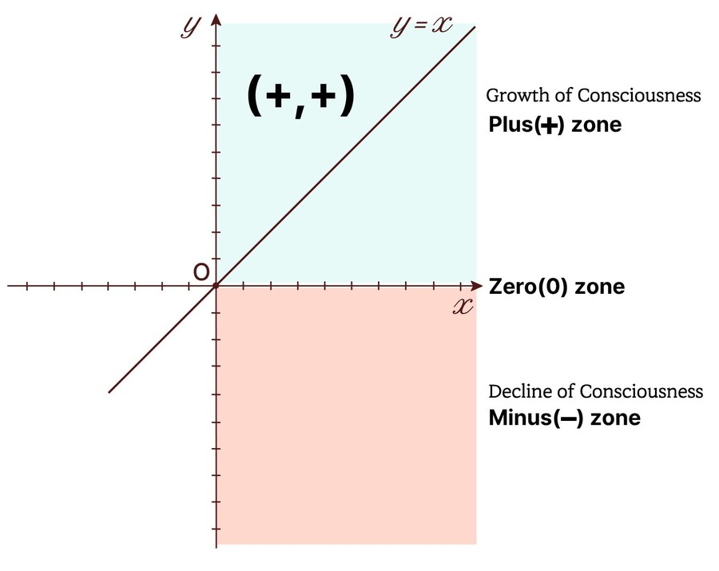

```{=html}
<section class="pz-hero compact"><div class="wrap"><div class="txt"><span class="eyebrow">PLUSZONE EDUCATION · VALUE-CENTERED CHARACTER EDUCATION</span><h1>When teachers change their questions,<br>children’s values stand firm,<br><em>and the classroom changes!</em></h1><p class="sub">A field-tested, value-centered character education solution based on the book <i>A Teacher’s Guide to the Art of Character Education</i></p><div class="cta"><a class="buy-btn primary" href="programs.html">Explore programs</a><a class="buy-btn" href="#contact">Contact us</a></div></div><figure class="plus-graph"><figcaption>(+,+): the growth of consciousness</figcaption></figure></div></section>
<section class="wrap"><div class="topics"><a class="topic" href="about.html"><span class="tn">01</span><span class="eyebrow">ABOUT</span><b>Two teachers who found answers in the classroom</b><span class="ts">34 and 22 years in the classroom became the starting point of PLUSZONE Education.</span><span class="ta" aria-hidden="true">→</span></a><a class="topic" href="approach.html"><span class="tn">02</span><span class="eyebrow">APPROACH</span><b>Warm questions instead of lectures</b><span class="ts">Four processes, the Three-Step Questioning Method and ten universal values</span><span class="ta" aria-hidden="true">→</span></a><a class="topic" href="programs.html"><span class="tn">03</span><span class="eyebrow">PROGRAMS</span><b>Training tailored to your organization</b><span class="ts">Teacher training, school consulting and curricula for eight audiences</span><span class="ta" aria-hidden="true">→</span></a><a class="topic" href="stories.html"><span class="tn">04</span><span class="eyebrow">STORIES</span><b>How questions changed classrooms</b><span class="ts">Student changes, classroom cases and teachers’ reflections</span><span class="ta" aria-hidden="true">→</span></a><a class="topic" href="book.html"><span class="tn">05</span><span class="eyebrow">BOOK</span><b>A Teacher’s Guide to the Art of Character Education</b><span class="ts">The two authors’ record from the classroom</span><span class="ta" aria-hidden="true">→</span></a><a class="topic" href="shop.html"><span class="tn">06</span><span class="eyebrow">SHOP</span><b>Where to buy</b><span class="ts">Kyobo · YES24 · Aladin · Amazon</span><span class="ta" aria-hidden="true">→</span></a></div></section><section class="wrap"><div class="contact-band" id="contact">
<h2>Contact & Enquiries</h2>
<p class="org">Publisher & program operator · PLUSZONE EDU SOLUTION</p>
<div class="items">
<div class="it"><span class="ico rose"><svg viewBox="0 0 24 24" fill="none" stroke="currentColor" stroke-width="2" stroke-linecap="round" stroke-linejoin="round" aria-hidden="true"><path d="M22 16.9v3a2 2 0 0 1-2.2 2 19.8 19.8 0 0 1-8.6-3.1 19.5 19.5 0 0 1-6-6A19.8 19.8 0 0 1 2.1 4.2 2 2 0 0 1 4.1 2h3a2 2 0 0 1 2 1.7c.1.9.4 1.8.7 2.7a2 2 0 0 1-.5 2.1L8 9.8a16 16 0 0 0 6 6l1.3-1.3a2 2 0 0 1 2.1-.4c.9.3 1.8.6 2.7.7a2 2 0 0 1 1.7 2z"/></svg></span><div><small>Training & consulting</small><a href="tel:+821055280079">+82 10-5528-0079</a></div></div>
<div class="it"><span class="ico rose"><svg viewBox="0 0 24 24" fill="none" stroke="currentColor" stroke-width="2" stroke-linecap="round" stroke-linejoin="round" aria-hidden="true"><rect x="2" y="4" width="20" height="16" rx="2"/><path d="m22 6-10 7L2 6"/></svg></span><div><small>Email</small><a href="mailto:pluszoneedu@gmail.com">pluszoneedu@gmail.com</a></div></div>
<div class="it"><span class="ico rose"><svg viewBox="0 0 24 24" fill="none" stroke="currentColor" stroke-width="2" stroke-linecap="round" stroke-linejoin="round" aria-hidden="true"><circle cx="12" cy="12" r="10"/><path d="M2 12h20M12 2a15 15 0 0 1 0 20M12 2a15 15 0 0 0 0 20"/></svg></span><div><small>Website</small><a href="https://edupluszone.com">www.edupluszone.com</a></div></div>
</div></div></section><div class="pz-end"></div>
```
