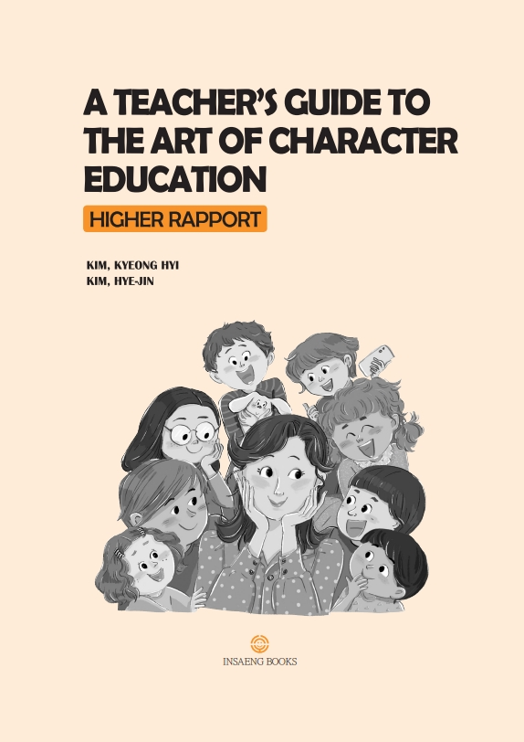

<!-- ============================================================
  English page for 『인성 교육, 참! 잘하는 교사』
  (A Teacher's Guide to the Art of Character Education)
  Text is based on the English edition manuscript.
  The top menu (Pluszone Education / Home / English) comes from the navbar in _quarto.yml.
============================================================= -->

::: {#top .hero .en}
::: wrap
::: hero-text
[From Insaeng Books · Education]{.eyebrow}

<h1>A Teacher's Guide to the Art of Character Education</h1>

[Higher Rapport]{.tagline}

::: summary
A casebook of character education that makes both teachers and students happier. Through real cases from Korean schools, two teachers show how to guide children from negative to positive behaviour, prevent bullying and verbal abuse before they start, and bring about lasting change in students' character.
:::

::: meta
[By Kim Kyeong Hyi and Kim Hye-jin]{} [Insaeng Books]{} [July 6, 2023]{} [314 pages]{}
:::

::: meta
[Original Korean title: 『인성 교육, 참! 잘하는 교사』]{}
:::

:::

::: cover-stage
::: cover
{fig-alt="Cover of A Teacher's Guide to the Art of Character Education by Kim Kyeong Hyi and Kim Hye-jin"}
:::
:::
:::
:::

::: quote-band
“For a Proper Understanding and Application of the Character Education Casebook”
:::

::: {#intro .section .intro}
::: wrap
::: head
[BOOK OVERVIEW]{.eyebrow}

<h2>About the Book</h2>

::: illus
{fig-alt="In the school nurse's office, a teacher checks a child's injured leg while other children wait in line"}
:::
:::

::: body
With the Character Education Promotion Act, character education has become mandatory in Korean schools. Yet how to carry it out, and how to measure its results, remains unclear. Schools often fall back on eye-catching events that produce visible results but rarely lead to sustained growth in students' character.

The authors, a classroom teacher and a school health teacher, faced the same problem. This book gathers the cases they worked through in their own classrooms and offers practical, sustainable ways to respond: building Higher Rapport with students, diagnosing through questions, and setting clear value standards such as honesty, sincerity, diligence, consideration, forgiveness, love and positivity.

Character education, the authors argue, is not the same as psychological counselling or communication technique. It starts when teachers change their own thoughts, words and actions, and it reaches beyond the classroom into the home and the workplace.
:::
:::
:::

::: {#contents .section}
::: wrap
::: sec-head
<h2>Contents</h2>
[CONTENTS]{.eyebrow}
:::

::: toc-grid
::: toc-item
[01]{.n}
[[Part 1. Character Education Methods]{style="font-weight:700;font-size:20px;display:block;color:var(--ink)"} Higher Rapport · Diagnosing with Questions · Establishing the Correct Value Standards · Solidifying Value Standards]{}
:::

::: toc-item
[02]{.n}
[[Part 2. Three-Step Questioning in Character Education]{style="font-weight:700;font-size:20px;display:block;color:var(--ink)"} Recognition, Clarification and Application of Value Standards, with a case example]{}
:::

::: toc-item
[03]{.n}
[[Part 3. Case Studies in Student Guidance]{style="font-weight:700;font-size:20px;display:block;color:var(--ink)"} A child lacking affection · A child with ADHD · A child obsessed with a best friend · A child overly immersed in gaming · A child stressed by leadership roles · A child who cannot accept defeat]{}
:::

::: toc-item
[04]{.n}
[[Part 4. Cases of Teacher Consciousness Growth]{style="font-weight:700;font-size:20px;display:block;color:var(--ink)"} A complaint from a parent · Someone you dislike · Offensive language towards a teacher · A heavy workload · Negative feedback · Unwanted tasks · Criticism despite good work · The impact of honesty]{}
:::

::: toc-item
[+]{.n}
[[Preface and Conclusion]{style="font-weight:700;font-size:20px;display:block;color:var(--ink)"} For a proper understanding and application of the Character Education Casebook · It is necessary to view character education from a new perspective]{}
:::
:::
:::
:::

::: section
::: wrap
::: inside
[Inside the Book]{.eyebrow}

::: cols
> Character education differs from psychological counseling and occupies a distinct level beyond mere communication techniques.
>
> <footer>Preface, p. 8</footer>

> Eventually, it dawned on me: ‘Ah, my students weren’t ignoring me. It was my perception that led me to feel ignored.’
>
> <footer>Conclusion, p. 317</footer>
:::
:::
:::
:::

::: section
::: wrap
<h2>Who This Book Is For</h2>

::: readers
::: reader
**Teachers**

[Teachers who want to guide children from negative to positive behaviour and prevent school violence before it starts]{}
:::

::: reader
**Future teachers**

[Aspiring teachers preparing to put character education into practice in their own classrooms]{}
:::

::: reader
**Parents**

[Parents who want to apply the same approach to raising their children at home]{}
:::

::: reader
**Schools**

[Schools looking for sustained character education rather than one-off events]{}
:::
:::
:::
:::

::: {#author .section .author}
::: wrap
::: head
[AUTHORS]{.eyebrow}

<h2>Kim Kyeong Hyi Kim Hye-jin</h2>
:::

::: info
Two Korean teachers, one a classroom teacher and the other a school health teacher, share the character education cases they carried out in their own schools. Their approach grows out of more than twenty years in the classroom, and they share it through workshops, teacher-training sessions, camps and lectures for aspiring teachers.
:::
:::
:::

::: {#contact .wrap .contact-line}
Contact [insaengbooks@gmail.com](mailto:insaengbooks@gmail.com)
:::
