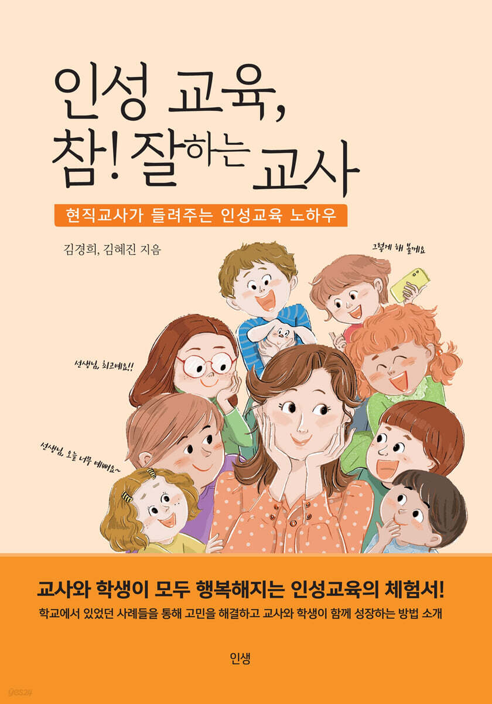
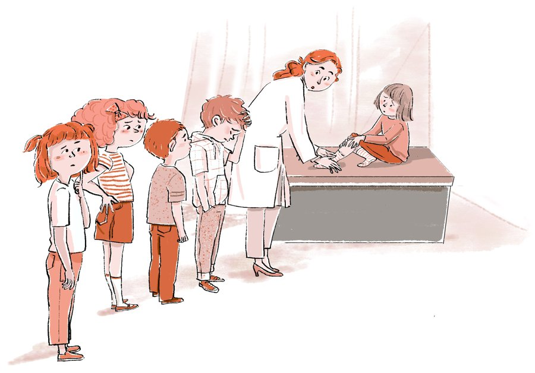

<!-- ============================================================
  인생북스 홈페이지 — 「인성교육 참 잘하는 교사」
  대괄호 [ ] 로 표시된 곳을 실제 내용으로 바꿔 주세요.
  상단 메뉴(Pluszone Education / Home / English)는 _quarto.yml 의 navbar 에서 만듭니다.
============================================================= -->

::: {#top .hero}
::: wrap
::: hero-text
[인생북스 신간 · 교육]{.eyebrow}

<h1>인성 교육, 참! 잘하는 교사</h1>

[현직교사가 들려주는 인성교육 노하우]{.tagline}

::: summary
교사와 학생이 모두 행복해지는 인성교육의 체험서! 
학교에서 있었던 사례들을 통해 고민을 해결하고, 교사와 학생이 함께 성장하는 방법을 소개합니다.
:::

::: meta
[김경희, 김혜진 지음]{} [인생북스]{} [2023년 7월 16일]{} [314쪽]{}
:::

:::

::: cover-stage
::: cover
{fig-alt="『인성 교육, 참! 잘하는 교사』 표지 — 김경희, 김혜진 지음"}
:::
:::
:::
:::

::: quote-band
“교사와 학생이 모두 행복해지는 인성교육의 체험서”
:::

::: {#intro .section .intro}
::: wrap
::: head
[BOOK OVERVIEW]{.eyebrow}

<h2>책 소개</h2>

::: illus
{fig-alt="보건실에서 선생님이 다리를 다친 아이를 살피고, 아이들이 줄을 서서 기다리는 모습"}
:::
:::

::: body
인성교육진흥법이 제정되면서 학교에서도 인성교육을 의무적으로 시행하게 되었습니다. 하지만 어떻게 해야 하는지, 어떤 상태에 다다라야 하는지가 명확하지 않다 보니 눈에 드러나는 이벤트성 프로그램에 집중하게 되기 쉽습니다. 이런 활동만으로는 바람직한 인성의 변화를 지속적으로 이끌어주기 어렵습니다.

이 책은 같은 고민을 해 온 두 현직 교사가 교실 현장에서 실제로 겪은 사례를 나누며 찾아낸, 공감할 수 있고 효과적이며 지속적인 해결책을 담았습니다. 하이어라포(Higher Rapport) 형성, 질문으로 진단하기, 가치기준 바로 세우기와 굳히기, 인성교육 3단계 질문법을 학생 지도 사례와 교사 의식성장 사례로 풀어냅니다.

부정적인 아이를 긍정적인 아이로 변화시키고 싶을 때, 학교폭력(따돌림, 언어폭력)을 미리 예방하고 싶을 때, 깊이 있는 인성의 변화를 이끌어내고 싶을 때 이 책의 사례가 도움이 될 것입니다. 그뿐만 아니라 가정과 직장에서도 적용할 수 있습니다.
:::
:::
:::

::: {#contents .section}
::: wrap
::: sec-head
<h2>목차</h2>
[CONTENTS]{.eyebrow}
:::

::: toc-grid
::: toc-item
[01]{.n}
[[Part 1. 인성교육 방법]{style="font-weight:700;font-size:20px;display:block;color:var(--ink)"} Higher Rapport · 질문으로 진단하기 · 가치기준 바로 세우기 · 가치기준 굳히기]{}
:::

::: toc-item
[02]{.n}
[[Part 2. 인성교육 3단계 질문법]{style="font-weight:700;font-size:20px;display:block;color:var(--ink)"} 1단계 가치기준 인식 · 2단계 가치기준 명확화 · 3단계 가치기준 적용]{}
:::

::: toc-item
[03]{.n}
[[Part 3. 학생 지도 사례]{style="font-weight:700;font-size:20px;display:block;color:var(--ink)"} 애정결핍으로 의존하는 아이 · ADHD 아이 · 단짝 친구에 집착하는 아이 · 게임에 과몰입하는 아이 · 리더 역할을 하며 스트레스를 받는 아이 · 패배를 견디지 못하는 아이]{}
:::

::: toc-item
[04]{.n}
[[Part 4. 교사 의식성장 사례]{style="font-weight:700;font-size:20px;display:block;color:var(--ink)"} 학부모에게 민원을 받았을 때 · 미운 사람이 있을 때 · 아이가 교사에게 욕을 했을 때 · 일이 넘쳐 마음이 조급할 때 · 부정적인 피드백을 들을 때 · 하기 싫은 일을 하라고 할 때 · 잘하고도 비난받을 때 · 정직했을 때 일어나는 일]{}
:::

::: toc-item
[+]{.n}
[[머리말과 맺음말]{style="font-weight:700;font-size:20px;display:block;color:var(--ink)"} 인성교육 사례집의 올바른 이해와 적용을 위하여 · 새로운 시각으로 인성교육을 바라보는 것이 필요하다]{}
:::
:::
:::
:::
:::

::: section
::: wrap
::: inside
[책 속으로]{.eyebrow}

::: cols
> 인성교육은 심리학의 상담과 다르고 단순한 의사소통 기법과 차원이 다른 영역입니다.
>
> <footer>인성교육 사례집의 올바른 이해와 적용을 위하여, 8쪽</footer>

> ‘아~ 아이들이 무시한 것이 아니라 나 혼자 무시당한다고 생각했구나!’ 무시한 사람은 없는데 무시당한 사람을 존재하게 한 나의 무의식 속 부정의 용종을 발견한 순간이었다.
>
> <footer>맺음말, 319쪽</footer>
:::
:::
:::
:::

::: section
::: wrap
<h2>이런 분께 권합니다</h2>

::: readers
::: reader
**현직 교사**

[부정적인 아이를 긍정적으로 변화시키고, 학교폭력을 미리 예방하고 싶은 선생님]{}
:::

::: reader
**예비 교사**

[교실에 서기 전에 인성교육의 방법을 익히고 싶은 예비 교사]{}
:::

::: reader
**학부모**

[가정에서도 같은 원리로 아이의 인성을 기르고 싶은 부모]{}
:::

::: reader
**학교**

[이벤트성 프로그램을 넘어 지속적인 인성교육을 고민하는 학교]{}
:::
:::
:::
:::

::: {#author .section .author}
::: wrap
::: head
[AUTHOR]{.eyebrow}

<h2>김경희 · 김혜진</h2>
:::

::: info
담임교사와 보건교사, 두 현직 교사가 학교 현장에서 실천한 인성교육 사례를 담았습니다. 20년 이상의 현장 경험을 바탕으로 워크숍과 교사 연수, 예비교사를 위한 캠프와 강의를 통해 많은 교사와 고민을 나누며 함께 성장해 왔습니다.
:::
:::
:::

::: {#contact .wrap .contact-line}
문의 [insaengbooks@gmail.com](mailto:insaengbooks@gmail.com)
:::
