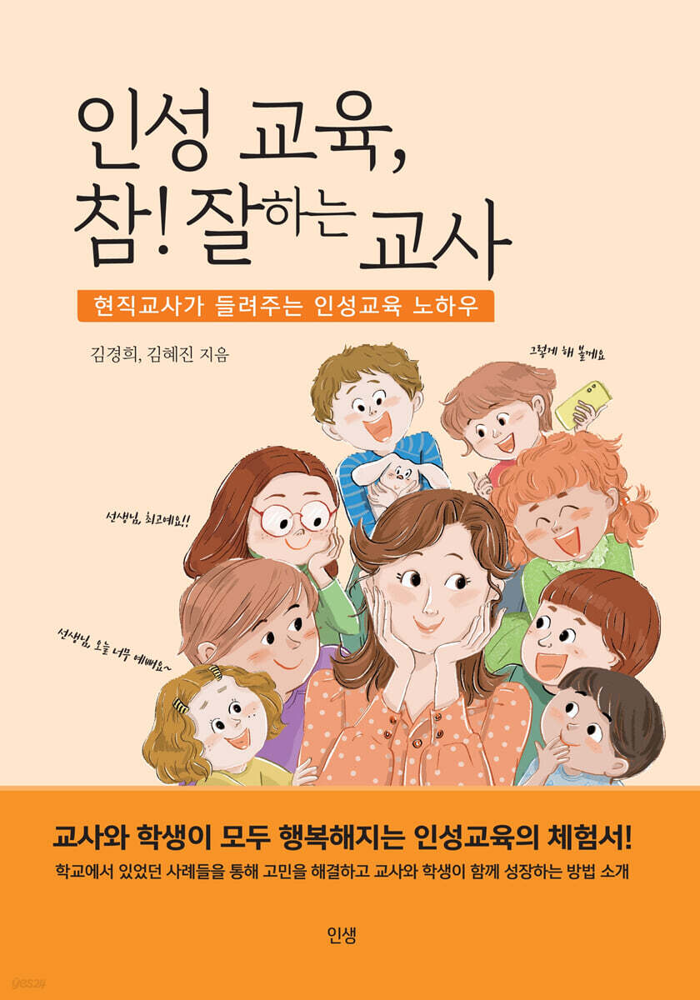
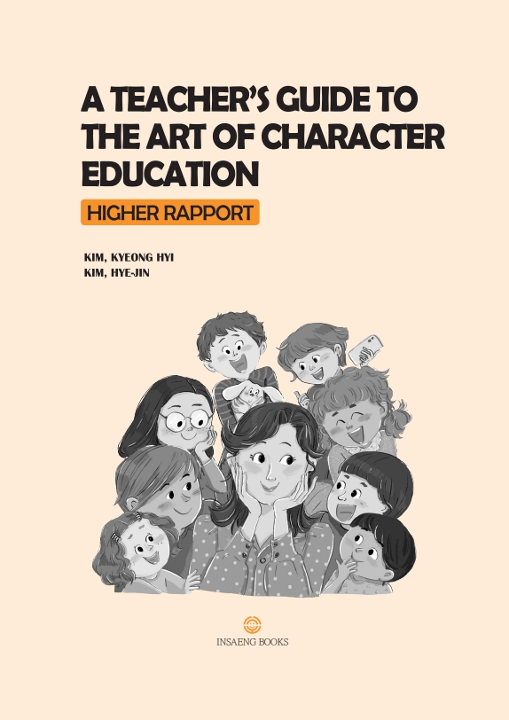

<!-- 도서 구매 페이지. 구매 링크는 모두 이 페이지에서 관리합니다. -->

```{=html}
<section class="wrap shop-head">
  <span class="eyebrow">SHOP</span>
  <h1>Where to Buy</h1>
  <p>The English edition is available on Amazon, and the Korean edition from Korean online bookstores.</p>
</section>

<section class="wrap">
  <div class="editions">
    <article class="edition" lang="ko">
      
      <div class="info">
        <span class="eyebrow">한국어판</span>
        <span class="ttl">인성 교육, 참! 잘하는 교사</span>
        <span class="sub">김경희, 김혜진 지음 · 인생북스<br>2023년 7월 16일 · 314쪽</span>
        <div class="stores">
          <a class="buy-btn primary" href="https://product.kyobobook.co.kr/detail/S000208434189">교보문고</a>
          <a class="buy-btn" href="https://www.yes24.com/product/goods/121208076">예스24</a>
          <a class="buy-btn" href="https://www.aladin.co.kr/shop/wproduct.aspx?ItemId=322075026">알라딘</a>
        </div>
      </div>
    </article>
    <article class="edition" lang="en">
      
      <div class="info">
        <span class="eyebrow">ENGLISH EDITION</span>
        <span class="ttl">A Teacher's Guide to the Art of Character Education</span>
        <span class="sub">Kim Kyeong Hyi, Kim Hye-jin · Insaeng Books<br>July 6, 2023 · 314 pages</span>
        <div class="stores">
          <a class="buy-btn primary" href="https://a.co/d/0fYIymSr">Buy on Amazon</a>
        </div>
      </div>
    </article>
  </div>
</section>
```

::: {#contact .wrap .contact-line}
Contact [pluszoneedu@gmail.com](mailto:pluszoneedu@gmail.com)
:::
